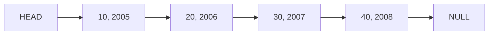

# Team Learning Activity

Whenever you need to quickly add and remove items, but those items are always in order - a Linked List is a good option for the data structure. In this Lab, we will explore a **Singly Linked List**. You will then use this linked list as the foundation for the stack in your homework. 

**Precondition**: Make sure to review the page on structs, iterators, linked lists, and nodes in Canvas if you haven't!

## Team Activity
For this team activity, you will meet as a group at the scheduled meeting in MS Teams. The notes you take as a team should be stored in the files section of that meeting, and while not required, it is recommended that you create a nice naming scheme for the TAs to see the notes. They will also have access to your chat logs in the team.  They will use the attendance record to award points. 


## Part 1: Picturing Linked Lists

Given the following code, draw out the final memory structure similar to how you did in [Homework 02](https://github.com/CS5008-khoury-lionelle/hw02#linking-to-images).  You can draw with a program, or one person can draw (with direction from others) on paper and take a picture.

```c
typedef struct node
{
    int num_wins;
    int year;
    struct node *next;
} Pair;

Pair *new_node(int wins, int year, Pair *next)
{
    Pair *newNode = (Pair*)malloc(sizeof(Pair));
    newNode->num_wins = wins;
    newNode->year = year;
    newNode->next = next;
    return newNode;
}

Pair* create_simple_list() {
   Pair *fourth = new_node(40, 2008, NULL);
   Pair *third = new_node(30, 2007, fourth);
   Pair *second = new_node(20, 2006, third);
   Pair *head = new_node(10, 2005, second);
   return head;
}

int main() {
   Pair* head = create_simple_list();
   return 0;
}
```

In addition the the memory diagram you draw, a way you can show a linked list is the following:




### Exploring the Code

Take a look at [linkedlist.h](linkedlist.h). Describe what you see and notice. Pay attention to the `push_front` and `add_back` functions. In your own words, describe to each other what each function does. 

#### Drawing Push Front
Using a similar drawing to the list above, draw out what happens when you call `push_front`. The important part is to help understand the order of the code, and what happens to the pointers.


### Iterating over a Linked List
As a group, write a function the iterates over the list, and prints out the values. The above list would look like the following:

```text
(10, 2005) -> (20, 2006) -> (30, 2007) -> (40, 2008) 
```

#### Test printing a list
Using the main function in [main.c], go ahead and build a list by looping over the arrays. Then, print out the list.

If you did it correctly, your print should look like
```text
(108, 2018) -> (93, 2017) -> (93, 2016) -> (78, 2015) -> (71, 2014) 
```

#### More Iteration Practice - Find
Looking at the function `Pair *find(PairList *list, int year)`, write a function that finds a node in the list, and returns it. If the node is not found, return NULL.

Add more tests to your main function to test this function.


#### More Iteration Practice - Free

So far, the program has a major error. The memory is not being freed! Write a function that frees the memory in the list. Discuss why you need a separate function to do this instead of just calling `free(list)` in the main function.

### Insert and Remove

As a group, discuss how you would insert and remove an item in the middle of the list. Draw out how that would look with pointers.  


## Part 2: Stack and Queue

Reviewing back to your CS 5001 class, you learned briefly about stacks and queues. Take a moment to discuss the differences, and then describe how a linked list could be used for either. Is it better for a stack or a queue? Why? This may involve some research, but why would you want to use a linked list over an array for a stack or queue? (and vise versa). 


## Technical Interview Practice

Take time practicing some of the past modules challenge problems. While you may not have time for everyone to do this, have a couple people practice "live coding". Live coding is a skill in interviews were you are asked to describe code **while** you are writing it. It can be a challenging skill, and it takes practice. I recommend that you setup a rotation of people to practice this skill within your team, ideally a couple every week. The other teams members can offer support, and then do a code review after a solution is generated. Then, as a group work a technical interview problem to discuss possible solutions.

## 📝 Grading Rubric

This activity is manually graded by TAs looking at the attendance record and making sure notes were taken for the meeting.


## 📚 Resources
* [Red Sox Data Source](http://www.espn.com/mlb/history/teams/_/team/Bos)
* [Red Sox Data (CSV)]( https://www.ccs.neu.edu/home/awjacks/cs3650f18/Labs/2/red_sox_history.csv)
* [C LinkedList Tutorial](https://www.learnc.net/c-data-structures/c-linked-list/)
* [Crash Course on C Linked Lists](https://www.youtube.com/watch?v=SB9si64asSk&index=8&list=PLvv0ScY6vfd8qupx0owF78ZcbvySvbWfx)
* [C Struct Tutorials Point](https://www.tutorialspoint.com/cprogramming/c_structures.htm)
* [C Pointers Tutorials Point](https://www.tutorialspoint.com/cprogramming/c_pointers.htm)
* [Another C LinkedList tutorial](https://www.cprogramming.com/tutorial/c/lesson15.html)
* [More on Typedef](https://en.wikipedia.org/wiki/Typedef)
