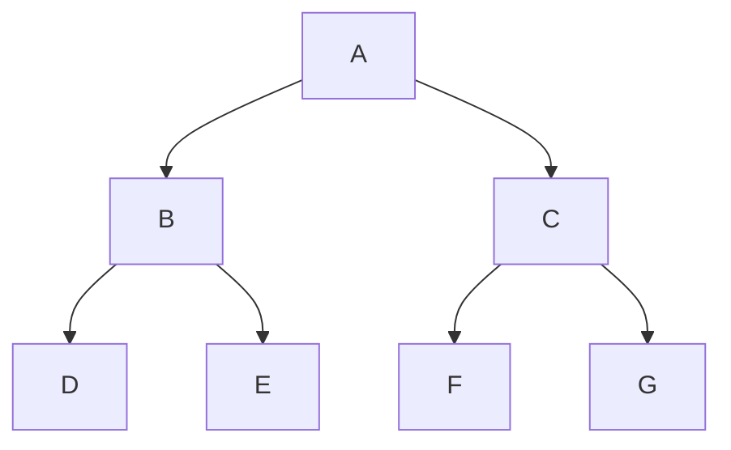

# Team Activity: Breadth First Search and Depth First Search on Trees

In this team activity you will explore using [Breadth First Search] and [Depth First Search] on a tree structure. 


## Code Walkthrough
In your group, review the code in [tree.h](tree.h) & [tree.c](tree.c). Explain to each other the various lines.
You should be able to answer the following questions:

* What is the purpose of the struct?
* What is the difference between addNode and addNodeBreadthFirst?
* Why would we need to remove `\n` in `read_file_into_tree`?
* How are we adding nodes to a tree? Given the file [letters.txt](letters.txt), how does the tree look like?
  
Now, review the code in [printer.c](printer.c). Explain to each other the various lines.
You should be able to answer the following questions:

* Why would be need a queue for a breadth first search? (it may help to draw it out)
* Would we need a queue for the Depth First Prints? Why or why not?


## Different Search Types
Looking at [letters.txt](letters.txt), we have A-G, in order. We can use this to create a tree structure,
and we will be focusing on a breadth first creation of the tree, by using the letters.txt file.



### Breadth First Search
Breadth first search is a search algorithm that starts at the root node, and explores all of the neighbor nodes at the present depth prior to moving on to the nodes at the next depth level. Printing the letters in breadth first order would be: `A, B, C, D, E, F, G`. This is especially true as the order we added nodes was in a breadth first manner for this particular tree. 


### Depth First Search: Preorder
Preorder is a depth first search, where the root is visited first, then the left subtree, then the right subtree.
Printing the letters in preorder would be: `A, B, D, E, C, F, G`. Take a moment to draw out the order
of the visits, and how this would look on the tree.


### Depth First Search: Postorder
Postorder is a depth first search, where the left subtree is visited first, then the right subtree, then the root.
Postorder would be: `D, E, B, F, G, C, A`. Take a moment to draw out the order based on the tree node traversal.


### Depth First Search: Inorder
Inorder is a depth first search, where the left subtree is visited first, then the root, then the right subtree.
Inorder would be: `D, B, E, A, F, C, G`. Take a moment to draw out the order based on the tree node traversal.


## 👉🏽 **Task** 👈🏽 - Write DFS Prints 

In [printer.c](printer.c), you will find a function `print_bfs` that prints the tree in a breadth first manner. Your task is to write the `print_dfs_preorder`, `print_dfs_postorder`, and `print_dfs_inorder` functions. These functions are much simpler than the `print_bfs` function. Also, they are recursive functions. It is recommended you get one of the functions working first, as the other two are very similar with only a change on where you put the print statement.

### Testing Print
To test your breadth first print, you can run the following commands:

```console
make 
./dfs_print.out letters.txt breadthfirst
```

To test the other print types, replace breadthfirst with preorder, postorder, or inorder. 


## 👉🏽 **Task** 👈🏽 - Use gnomes_names.txt
Using the names in [gnome_names.txt](gnome_names.txt)<sup>[2]</sup>, draw out the tree structure, each of the types of prints. Then run what you think the output would be against the output of your program. This file contains 10 names, so you would end up with an unbalanced tree.


## 👉🏽 **Task** 👈🏽 - Practicing With Larger Files
In programming, we often need to test our code with larger files. In this case, we have a file [elf_names.txt](elf_names.txt) that contains 40 names. While this file isn't as large as some of the files we deal with in the real world, it is large to make
calculating the DFS and BFS prints by hand difficult. 

We have provided three test files:
* elf_names_preorder.txt
* elf_names_postorder.txt
* elf_names_inorder.txt

The names are as they sound, the preorder, postorder, and inorder prints of the tree from elf_names.txt. In order to learn some of the tools we can use to test our code, we will be using the `diff` command. Run your code with the elf_names.txt file, with the following commands

```console
./dfs_print.out elf_names.txt preorder > my_preorder.txt
diff elf_names_preorder.txt my_preorder.txt
```

By default if the files are exactly the same, you will get no output. If there is a difference, you will get a line by line comparison of the two files. You can add a flag to tell it when the files are exactly the same, by adding the -s flag. 


```console
diff -s elf_names_preorder.txt my_preorder.txt
```

Try that with each of the ordering types. 

## Discussion  💬

In your group, discuss the following questions:

* What is the difference between a breadth first search and a depth first search?
* What tasks are suited for a breadth first search?
* What tasks are suited for a depth first search?
* Can you come up with everyday examples of inorder, postorder, and preorder? (hint, look at your calculator)

Also for the tree:
* Define a Binary Search Tree. Write out the steps to add a node to a Binary Search Tree, and use a [gnomes_names.txt](gnomes_names.txt) file to draw out the tree that is a BST format. 
  * How many steps is needed to get to `Canonsbass` as compared to just looking line by line in the file? 
* Discuss how you would implement a Binary Search Tree (BST) using the tree structure we have created.  
  * You may want to look at addNode() in [tree.c](tree.c) to see how that can be modified to add nodes to a BST.
* If you have time, modify the add node to add as one would in a BST node. `strcmp` can give you the high/low for each node.


## Conclusion
In this team activity, we have learned about the different types of search algorithms, and how they can be used to traverse a tree. We have also learned about the different types of tree traversals, and how they can be used to print out the tree in different orders.

We will come back to the traversal types when we explore graphs, which are a more complex data structure than trees but the fundamentals are the same. Searching is used throughout computer science, and knowing your data and which search is best
often helps with the efficiency of your program. For a Binary Search Tree (your homework), that is almost exclusively depth first traversal of your code, as you always know "which direction" to traverse until you find the node you are looking for.

## Leet Code Practice
Take time practicing some of the past modules leet code. While you may not have time for everyone to do this, have a couple people practice "live coding". Live coding is a skill in interviews were you are asked to describe code **while** you are writing it. It can be a challenging skill, and it takes practice. I recommend that you setup a rotation of people to practice this skill within your team, ideally a couple every week. The other teams members can offer support, and then do a code review after a solution is generated. Discuss pros/cons of the leet code solution as well as other potential ways to solve the problem.

## 📚 Resources
* [Ordering Differences of DFS]
* [BFS vs DFS Binary Tree]
* [Difference Between BFS and DFS]
* [DFS Traversal of a Tree Using Recursion]
* [Tree Traversal BFS and DFS]
* [Visual BST]
* [GDB Cheat Sheet]
* [GNU Make Manual]

### Makefile?

You will notice for this team activity, we added a [Makefile](Makefile). A Makefile is a file that contains a set of instructions for the make program to execute. The make program is a program that is used to automate the build process of a program. In this case, we are using it to automate the compilation of our program. This helps when you have multiple files, and you want to compile them all at once. If you have used gradle or maven in java, this is similar to those tools (arguably those tools are inspired by `make`).

If you view the file, you will see comments on each line for what it does. Inside of linux, you can simply type "make" in the same
directory as the Makefile, and it will follow those rules. You can use `make clean` to remove the executable and object files. Right now the make files seems simple, but we will cover it a bit more in depth as we will have a few assignments in the future
that require more files. 

---

[2]: Names were generated by Fantasy Name Generator: https://www.fantasynamegenerators.com/gnome-names.php

[Ordering Differences of DFS]: https://en.wikipedia.org/wiki/Depth-first_search#Output_of_a_depth-first_search
[Depth First Search]: https://en.wikipedia.org/wiki/Depth-first_search
[Breadth First Search]: https://en.wikipedia.org/wiki/Breadth-first_search
[GDB Cheat Sheet]: https://cs.brown.edu/courses/cs033/docs/guides/gdb.pdf
[Visual BST]: https://visualgo.net/en/bst
[BFS vs DFS Binary Tree]: https://www.geeksforgeeks.org/bfs-vs-dfs-binary-tree/
[Difference Between BFS and DFS]: https://www.geeksforgeeks.org/difference-between-bfs-and-dfs/ 
[DFS Traversal of a Tree Using Recursion]: https://www.geeksforgeeks.org/dfs-traversal-of-a-tree-using-recursion/
[Tree Traversal BFS and DFS]: https://www.codingeek.com/data-structure/tree-traversal-bfs-and-dfs-introduction-explanation-and-implementation/
[GNU Make Manual]: https://www.gnu.org/software/make/manual/make.html