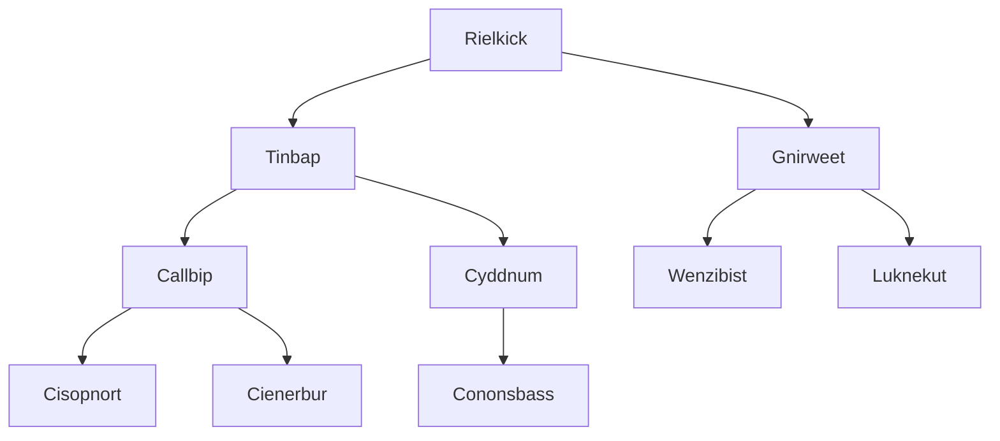
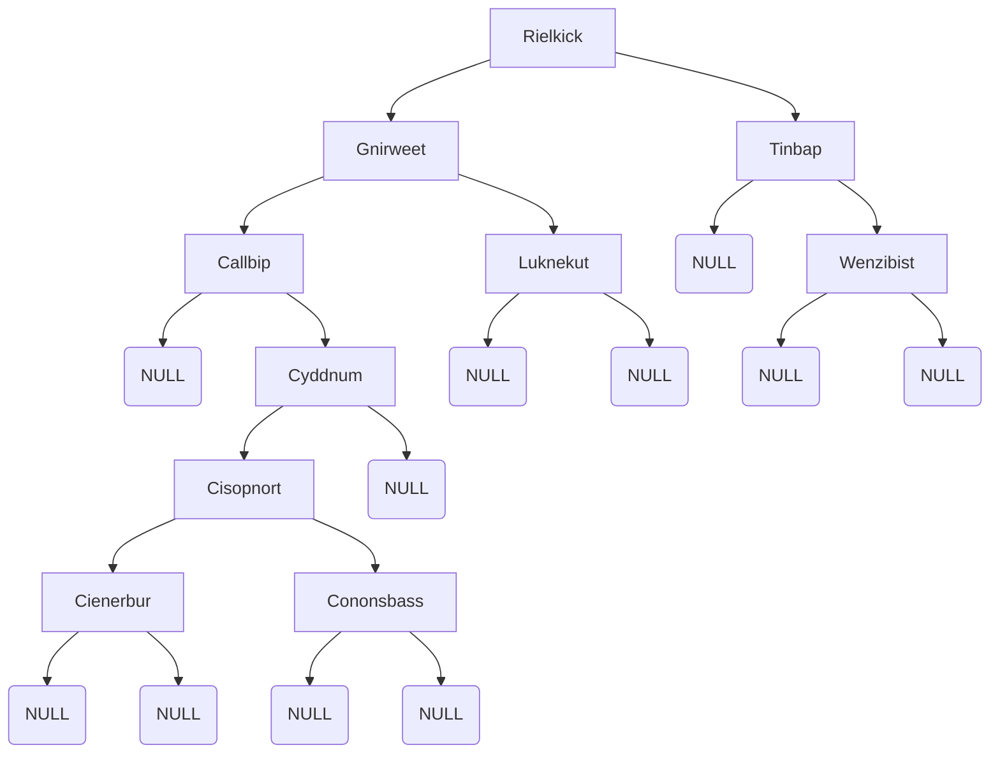

# Lab Solutions

This folder contains the solutions to the lab-dfs-bfs-practice lab. You should not jump to the solution, as
your goal is to seek understand, and just pulling up code does not provide understanding. Instead, you should work through
the lab, and then double check your work. 

For the DFS prints, notice how the location we print changes. For the preorder, we print before we recurse on the left and right. For the postorder, we print after we recurse on the left and right. For the inorder, we print after we recurse on the left, and before we recurse on the right. Or another way to look at it: inorder we print between our recursions. Post we print after, and pre we print before.

```c
/** inOrder DFS print of the Tree.h*/
void printTreeInOrder(Node* root) {
	if (root == NULL) {
		return;
	}
	printTreeInOrder(root->left);
	print_single_node(root);
	printTreeInOrder(root->right);
}

/** post order DFS print of the Tree.h */
void printTreePostOrder(Node* root) {
	if (root == NULL) {
		return;
	}
	printTreePostOrder(root->left);
	printTreePostOrder(root->right);
	print_single_node(root);
}

/** pre order DFS print of the Tree.h*/
void printTreePreOrder(Node* root) {
	if (root == NULL) {
		return;
	}
	print_single_node(root);
	printTreePreOrder(root->left);
	printTreePreOrder(root->right);
}
```
---

## Breadth First - gnome-names.txt
This is how the tree should look when nodes are added in a breadth first (opening) manner. 



---

## Binary Search Tree Structure (BST) for gnome_names.txt

Null/blank spots are added to keep the tree balanced, and to let mermaid render the tree properly. It also makes it 
easier to see the termination conditions as you traverse the nodes. For example, if you are searching for  the name "Quin", you would traverse the tree hitting NULL where Quin should be, and then you would know that Quin is not in the tree. 



Needless to say, the tree isn't very balanced. While there are algorithms to balance trees, we won't cover them here. 


