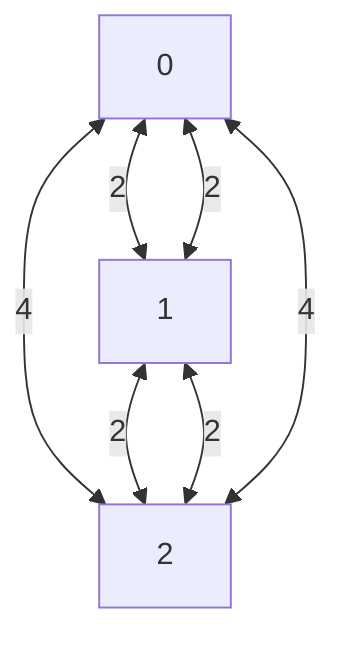
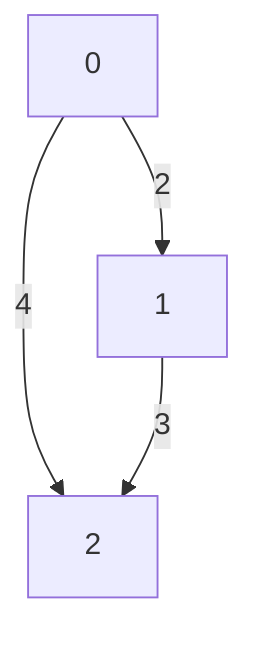

# Lab: Graph Representation - a Look at Adjacency Lists and Adjacency Matrices

In this lab, we will explore the two most common ways to represent a graph: adjacency lists and adjacency matrices. We will also look at the pros and cons of each representation.

## Provided Files
You will see there are a fair amount of provided files. This to help you see how to break up the files in a C program between headers and implementation files. You will also see that there are two different implementations of the graph data structure. One uses adjacency lists, and the other uses adjacency matrices. You will be implementing the functions in [converter.c](converter.c) to convert between the two representations.


## 📝 Practice Drawing a Graph

Before you work on that, take turns with a partner describing the provided code. This is called a **CODE WALK** and is often
a skill asked in technical interviews.  Make sure you understand how the code works, and that you can explain it to your partner. 

At this point, you can run `make` which will build the program. You can then run `./adj_fun.out` to run the program. You will see it will print 
out the graph as an adjacency matrix. 

Now, draw the graph on a piece of paper. 

### Example: 

```text
0 2 4 
2 0 2 
4 2 0 
```



or if you change the option to be directed..

```text
```text
0 2 4 
0 0 3 
0 0 0 
```




👉🏽 **Task** 👈🏽: Modify the code in [adj_fun.c](adj_fun.c) to print out the graph as an adjacency matrix using `DIRECTED_ONE_DIRECTION`, `DIRECTED_UNBALANCED`, and `UNDIRECTED`. You can do this by changing the `type` variable in the `main` function. 

**FOR EACH** of the types, draw the graph on a piece of paper. Talk 
it through with your partner. 


## 📝 Converters


👉🏽 **Task** 👈🏽: Write converts to convert between Adjacency Lists and Adjacency Matrices. You will need to implement the following functions:
* `AdjMatrix *convert_list_to_matrix(AdjList *list)`
* `AdjList *convert_matrix_to_list(AdjMatrix *matrix)`


The program and see if the matrix matches the list. You may need
to draw out the graph on a piece of paper to make sure the conversion is correct.

## Discussion

With your group, discuss the following

1. What are the pros and cons of each representation?
2. What is the space complexity of each representation?
3. What about time complexity of accessing a specific edge?
   * Give examples of when you would use each representation.
4. When would you want to (or not use) each?


## Leet Code
Now, if there is time remaining in the lab, work on a leet code problem. Make sure you talk through what you are doing with your partners. 


## 📚 Resources
* Adjacency List: https://en.wikipedia.org/wiki/Adjacency_list
* Adjacency Matrix: https://en.wikipedia.org/wiki/Adjacency_matrix
* Graph Representation: https://www.geeksforgeeks.org/graph-and-its-representations/
* Graph Visualization: https://www.cs.usfca.edu/~galles/visualization/Algorithms.html
* Comparison between Adjacency List and Adjacency Matrix: https://www.geeksforgeeks.org/comparison-between-adjacency-list-and-adjacency-matrix-representation-of-graph/

